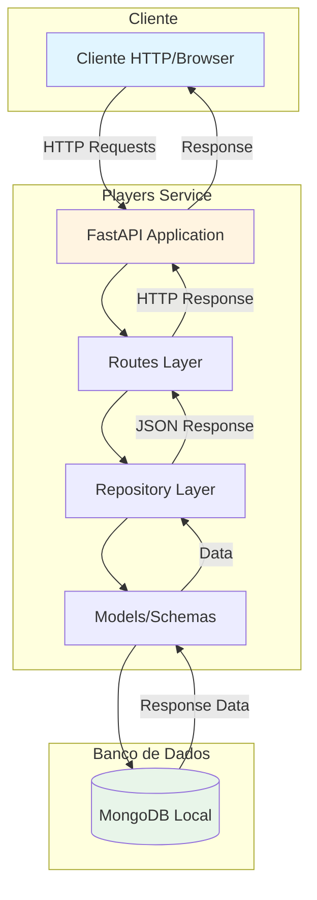
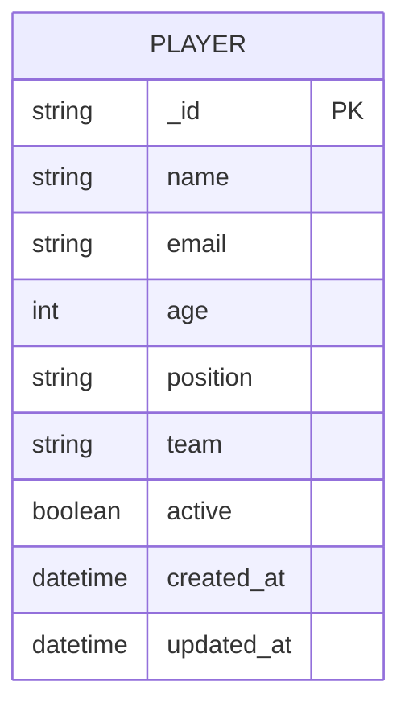
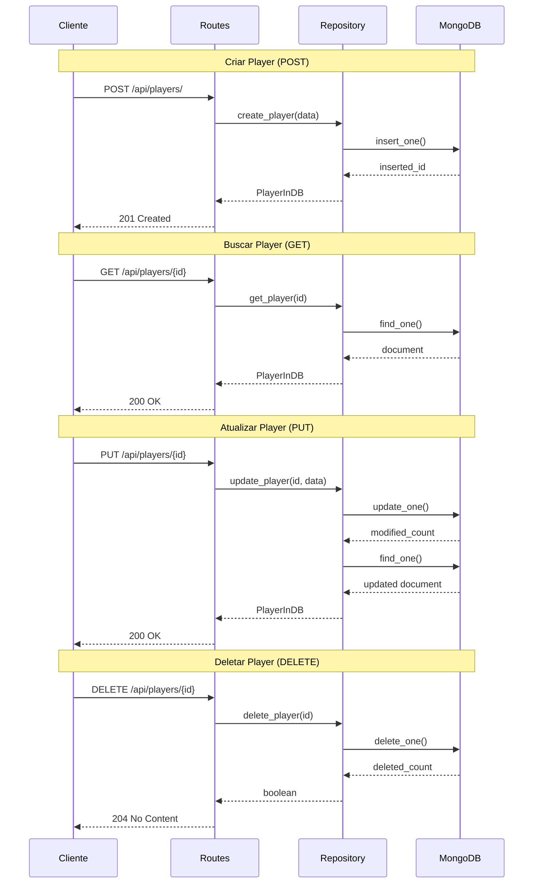
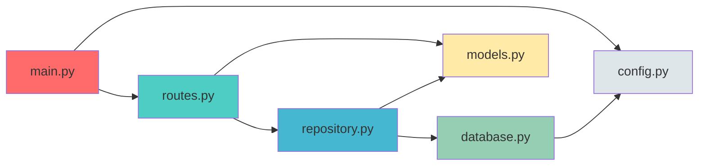

# Players Service

Microserviço de gerenciamento de jogadores usando FastAPI e MongoDB.

## 🏗️ Arquitetura



## 📊 Diagrama de Entidades



## 🔄 Fluxo de Operações CRUD



## 🚀 Tecnologias

- **FastAPI**: Framework web moderno e rápido
- **TinyDB**: Banco de dados NoSQL em arquivo JSON (zero configuração!)
- **Pydantic**: Validação de dados
- **Uvicorn**: Servidor ASGI de alta performance

## ⚡ Por que TinyDB?

✅ **Zero Configuração** - Não precisa instalar MongoDB ou qualquer servidor de banco de dados  
✅ **Desenvolvimento Rápido** - Funciona imediatamente após `pip install`  
✅ **Dados Visíveis** - Armazenado em JSON, fácil de visualizar e debugar  
✅ **Portável** - Funciona em qualquer SO sem dependências externas  
✅ **Perfeito para MVPs** - Ideal para protótipos e desenvolvimento local

## 📋 Pré-requisitos

1. Python 3.8 ou superior
2. pip (gerenciador de pacotes Python)

**Só isso!** Não precisa instalar MongoDB ou qualquer outro banco de dados. 🎉

## � Collections da API

Para facilitar os testes, disponibilizamos collections para Postman e Insomnia:

- **Postman**: `players_api.postman_collection.json`
- **Insomnia**: `players_api.insomnia.json`

### Como importar:

**Postman:**
1. Abra o Postman
2. Clique em "Import"
3. Selecione o arquivo `players_api.postman_collection.json`
4. A collection será importada com todas as requisições prontas

**Insomnia:**
1. Abra o Insomnia
2. Clique em "Import/Export" → "Import Data" → "From File"
3. Selecione o arquivo `players_api.insomnia.json`
4. A collection será importada com todas as requisições prontas

## �🔧 Instalação

1. Clone o repositório
2. Crie um ambiente virtual:
```bash
python -m venv venv
```

3. Ative o ambiente virtual:
```bash
# Windows PowerShell
.\venv\Scripts\Activate.ps1

# Windows CMD
.\venv\Scripts\activate.bat
```

4. Instale as dependências:
```bash
pip install -r requirements.txt
```

5. Configure as variáveis de ambiente no arquivo `.env` (opcional - já vem configurado):
```
MONGODB_URL=mongodb://localhost:27017
DATABASE_NAME=uscore_players
PORT=8000
# TinyDB não precisa de servidor, os dados ficam em ./data/uscore_players.json
```

## ▶️ Como Executar

1. Execute o servidor:
```bash
python run.py
```

Ou usando uvicorn diretamente:
```bash
uvicorn app.main:app --reload --port 8000
```

3. Acesse a documentação interativa:
- Swagger UI: http://localhost:8000/docs
- ReDoc: http://localhost:8000/redoc

## 📚 Endpoints da API

### Players

- `POST /api/players/` - Criar um novo jogador
- `GET /api/players/` - Listar todos os jogadores (com paginação)
- `GET /api/players/{player_id}` - Obter um jogador específico
- `PUT /api/players/{player_id}` - Atualizar um jogador
- `DELETE /api/players/{player_id}` - Deletar um jogador
- `GET /api/players/search?q={query}` - Buscar jogadores

### Health Check

- `GET /` - Informações da API
- `GET /health` - Status de saúde do serviço

## 📝 Exemplos de Uso

### Criar um jogador

```bash
curl -X POST "http://localhost:8000/api/players/" \
  -H "Content-Type: application/json" \
  -d '{
    "name": "João Silva",
    "email": "joao@example.com",
    "age": 25,
    "position": "Atacante",
    "team": "Team A",
    "active": true
  }'
```

### Listar jogadores

```bash
curl "http://localhost:8000/api/players/?skip=0&limit=10"
```

### Buscar jogadores

```bash
curl "http://localhost:8000/api/players/search?q=João"
```

## 🏗️ Estrutura do Projeto

```
playersService/
├── app/
│   ├── __init__.py
│   ├── main.py          # Aplicação FastAPI principal
│   ├── config.py        # Configurações
│   ├── database.py      # Conexão com MongoDB
│   ├── models.py        # Modelos Pydantic
│   ├── repository.py    # Camada de acesso aos dados
│   └── routes.py        # Rotas da API
├── .env                                      # Variáveis de ambiente
├── .gitignore
├── requirements.txt                          # Dependências
├── run.py                                   # Script para iniciar o servidor
├── players_api.postman_collection.json      # Collection Postman
├── players_api.insomnia.json                # Collection Insomnia
└── README.md
```

### Camadas da Aplicação



## 🔒 Modelo de Dados

### Player

```json
{
  "name": "string",
  "email": "string",
  "age": 0,
  "position": "string",
  "team": "string",
  "active": true
}
```

## 📦 Dependências Principais

- `fastapi==0.104.1` - Framework web
- `uvicorn==0.24.0` - Servidor ASGI
- `tinydb==4.8.0` - Banco de dados JSON local
- `pydantic==2.5.0` - Validação de dados
- `email-validator` - Validação de emails

## 💾 Armazenamento de Dados

Os dados são armazenados localmente em:
```
./data/uscore_players.json
```

Você pode:
- ✅ Visualizar o arquivo diretamente
- ✅ Editar manualmente se necessário
- ✅ Versionar com Git para dados de teste
- ✅ Fazer backup copiando o arquivo

## 🔄 Migração para MongoDB (Produção)

Se precisar migrar para MongoDB em produção:

1. Instale as dependências:
```bash
pip install motor pymongo
```

2. Atualize `app/database.py` para usar Motor
3. Configure `MONGODB_URL` para apontar para seu servidor MongoDB

Veja `MONGODB_SETUP.md` e `TINYMONGO_INFO.md` para mais detalhes.